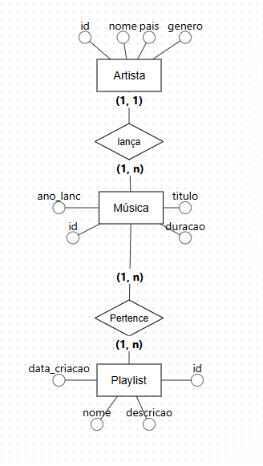

# Trabalho BD2 – Plataforma de Streaming de Músicas

Trabalho desenvolvido para a disciplina de **Banco de Dados II**, ministrada pelo Prof. Daniel Lichtnow (UFSM).

O domínio escolhido foi uma plataforma de streaming de músicas, composta por artistas, músicas e playlists. A modelagem foi implementada em MongoDB utilizando duas abordagens distintas:

* **Versão 1 – Embedded**
* **Versão 2 – Referenced**

## Modelo Conceitual (ER)



### Relacionamentos

* **Artista lança Música** → 1:N
* **Música pertence a Playlist** → N:N

---

## Modelo Lógico

### Versão 1 – Embedded (`streaming_v1`)

As músicas são armazenadas diretamente dentro dos documentos de artistas e playlists.

```text
artistas_v1
{
  _id,
  nome,
  pais,
  genero,
  musicas: [
    { titulo, duracao, ano_lanc }
  ]
}

playlists_v1
{
  _id,
  nome,
  descricao,
  data_criacao,
  musicas: [
    { titulo, duracao, artista_nome }
  ]
}
```

### Versão 2 – Referenced (`streaming_v2`)

As entidades são armazenadas em coleções separadas e relacionadas por referências. O relacionamento N:N é resolvido por uma coleção intermediária.

```text
artistas_v2
{
  _id,
  nome,
  pais,
  genero
}

musicas_v2
{
  _id,
  titulo,
  duracao,
  ano_lanc,
  artista_id
}

playlists_v2
{
  _id,
  nome,
  descricao,
  data_criacao
}

musicas_playlists
{
  musica_id,
  playlist_id
}
```

---

## Consultas

### V1-A – Artistas com Mais de Uma Música (Embedded, 1:N)

Lista o nome do artista, a quantidade de músicas e a duração média das músicas para artistas do gênero Rock que possuem mais de uma música, ordenando o resultado pela duração média em ordem decrescente.

```javascript
db.artistas_v1.aggregate([
    { $match: { genero: "Rock" } },
    { $unwind: "$musicas" },
    {
        $group: {
            _id: "$nome",
            total_musicas: { $sum: 1 },
            duracao_media: { $avg: "$musicas.duracao" }
        }
    },
    { $match: { total_musicas: { $gt: 1 } } },
    { $sort: { duracao_media: -1 } },
    {
        $project: {
            _id: 0,
            artista: "$_id",
            total_musicas: 1,
            duracao_media: { $round: ["$duracao_media", 0] }
        }
    }
])
```

### V1-B – Playlists de 2024 com a Música Mais Longa (Embedded, N:N)

Lista o nome da playlist, a quantidade de músicas e o título da música com maior duração, considerando apenas playlists criadas em 2024.

```javascript
db.playlists_v1.aggregate([
    {
        $match: {
            data_criacao: {
                $gte: ISODate("2024-01-01"),
                $lt: ISODate("2025-01-01")
            }
        }
    },
    {
        $addFields: {
            total_musicas: { $size: "$musicas" },
            musica_mais_longa: {
                $arrayElemAt: [
                    {
                        $sortArray: {
                            input: "$musicas",
                            sortBy: { duracao: -1 }
                        }
                    },
                    0
                ]
            }
        }
    },
    {
        $project: {
            _id: 0,
            playlist: "$nome",
            total_musicas: 1,
            musica_mais_longa: "$musica_mais_longa.titulo"
        }
    }
])
```

### V2-A – Artistas com Mais de Uma Música (Referenced, 1:N)

Mesma consulta da versão Embedded, porém utilizando `$lookup` para relacionar as coleções `artistas_v2` e `musicas_v2`.

```javascript
db.artistas_v2.aggregate([
    { $match: { genero: "Rock" } },
    {
        $lookup: {
            from: "musicas_v2",
            localField: "_id",
            foreignField: "artista_id",
            as: "musicas"
        }
    },
    { $unwind: "$musicas" },
    {
        $group: {
            _id: "$nome",
            total_musicas: { $sum: 1 },
            duracao_media: { $avg: "$musicas.duracao" }
        }
    },
    { $match: { total_musicas: { $gt: 1 } } },
    { $sort: { duracao_media: -1 } },
    {
        $project: {
            _id: 0,
            artista: "$_id",
            total_musicas: 1,
            duracao_media: { $round: ["$duracao_media", 0] }
        }
    }
])
```

### V2-B – Playlists de 2024 com a Música Mais Longa (Referenced, N:N)

Mesma consulta da versão Embedded, porém utilizando dois `$lookup` para percorrer a coleção intermediária `musicas_playlists`.

```javascript
db.playlists_v2.aggregate([
    {
        $match: {
            data_criacao: {
                $gte: ISODate("2024-01-01"),
                $lt: ISODate("2025-01-01")
            }
        }
    },
    {
        $lookup: {
            from: "musicas_playlists",
            localField: "_id",
            foreignField: "playlist_id",
            as: "relacoes"
        }
    },
    { $unwind: "$relacoes" },
    {
        $lookup: {
            from: "musicas_v2",
            localField: "relacoes.musica_id",
            foreignField: "_id",
            as: "musica"
        }
    },
    { $unwind: "$musica" },
    { $sort: { "musica.duracao": -1 } },
    {
        $group: {
            _id: "$nome",
            total_musicas: { $sum: 1 },
            musica_mais_longa: { $first: "$musica.titulo" }
        }
    },
    {
        $project: {
            _id: 0,
            playlist: "$_id",
            total_musicas: 1,
            musica_mais_longa: 1
        }
    }
])
```

---

## Como Executar

### 1. Baixar a imagem do MongoDB

```bash
docker pull mongodb/mongodb-community-server:latest
```

### 2. Criar e iniciar o container

```bash
docker run --name mongodb -p 27017:27017 -d mongodb/mongodb-community-server:latest
```

### 3. Abrir o terminal do container

No Docker Desktop:

* Localize o container `mongodb`;
* Clique nos três pontos ao lado do container;
* Selecione **Open in Terminal**.

### 4. Conectar ao MongoDB Shell

```bash
mongosh --port 27017
```

### 5. Executar a Versão 1

```javascript
use streaming_v1
```

Em seguida, execute todo o conteúdo do arquivo:

```text
streaming_v1.js
```

### 6. Executar a Versão 2

```javascript
use streaming_v2
```

Em seguida, execute todo o conteúdo do arquivo:

```text
streaming_v2.js
```

> O comando `use` deve ser executado antes da execução de cada script.

---

## Estrutura do Projeto

```text
.
├── README.md
├── streaming_v1.js
├── streaming_v2.js
└── modelo_er.png
```
